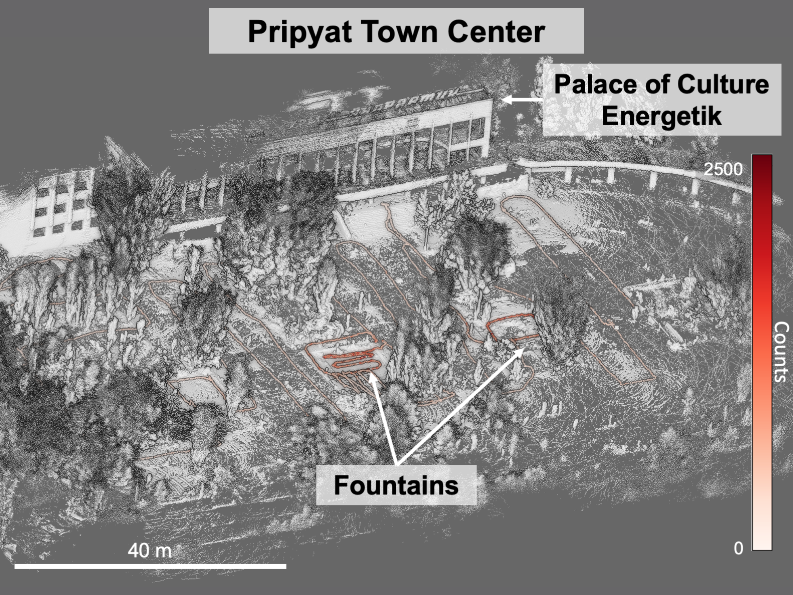
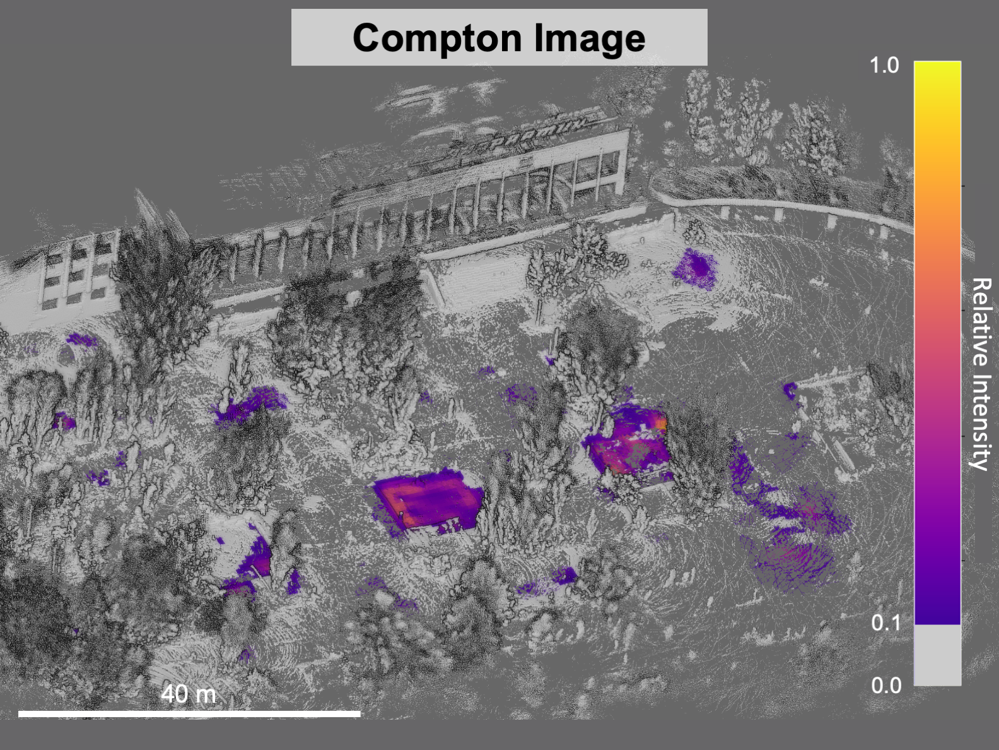

I am a nuclear engineering PhD student at UC Berkeley interested in radiation detection for applications in nuclear safeguards, security, and nonproliferation. My PhD research is on 3D Compton image reconstruction using a free-moving gamma-ray detector and auxiliary contextual sensor package. My focus has been on improving the use of information collected by the auxilliary contexual sensors through using computer vision techniques to identify and label objects in a LiDAR point cloud and optimizing static measurement positions for quantitative Compton imaging.

During my PhD I have analyzed data collected at the Fukushima Daiichi Nuclear Power Station to generate 3D images of a parking lot with contaminated vehicles. I have also analyzed data collected with Polaris-LAMP around the Chernobyl Nuclear Power Plant, including scenes around Pripyat such as the [famous amusement park](https://en.wikipedia.org/wiki/Pripyat_amusement_park). 

 

I received my B.S. in Nuclear Engineering from The University of Tennessee, Knoxville in May 2019. During undergrad, I conducted undergraduate research in the Materials Science & Engineering and Nuclear Engineering departments, where I analyzed candidate nuclear waste forms and evaluated the transition from an open to closed nuclear fuel cycle. I also interned at Argonne National Laboratory, where I developed code for SAS4A/SASSYS-1, a software used for deterministic analysis of transients in advanced nuclear reactors. 

I first became interested in safeguards on a study abroad trip to the IAEA in Vienna. To pursue this interest, I interned at Oak Ridge National Laboratory in the Safeguards & Security Technology group, where I investigated international safeguards methods for research reactors, and collected data from HFIR-REDC's Pu-238 production process to determine characteristics of normal operation at a research reactor with collocated hot cell facilities. 

I love science outreach and developing programs to support underrepresented groups in STEM. I am involved in [Berkeley Radwatch](https://radwatch.berkeley.edu/), an outreach group run by my lab which has performed a large range of radiation measurements since March 2011, following the releases of radioactive materials from the Daiichi Nuclear Power Plant in Japan. I am also involved with the Society of Women Engineers, having served as a mentoring cooridinator on the [GradSWE](http://gradswe.swe.org/) leadership team. I have also served as president, new student chair, and webmaster of the  [Berkeley GradSWE](https://gwe.berkeley.edu/) section. 

In my free time I like to climb, paddleboard, hike, run, cook, read and play tabletop games. I am also renovating a [1971 Islander 30 Mk II](https://sailboatdata.com/sailboat/islander-30-mk-ii) to liveaboard. No, I don't know how to sail.