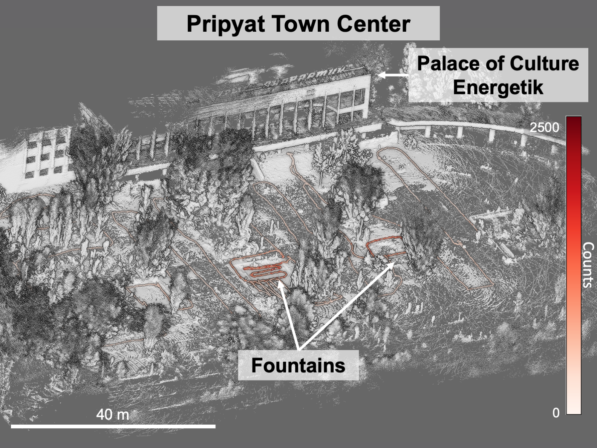
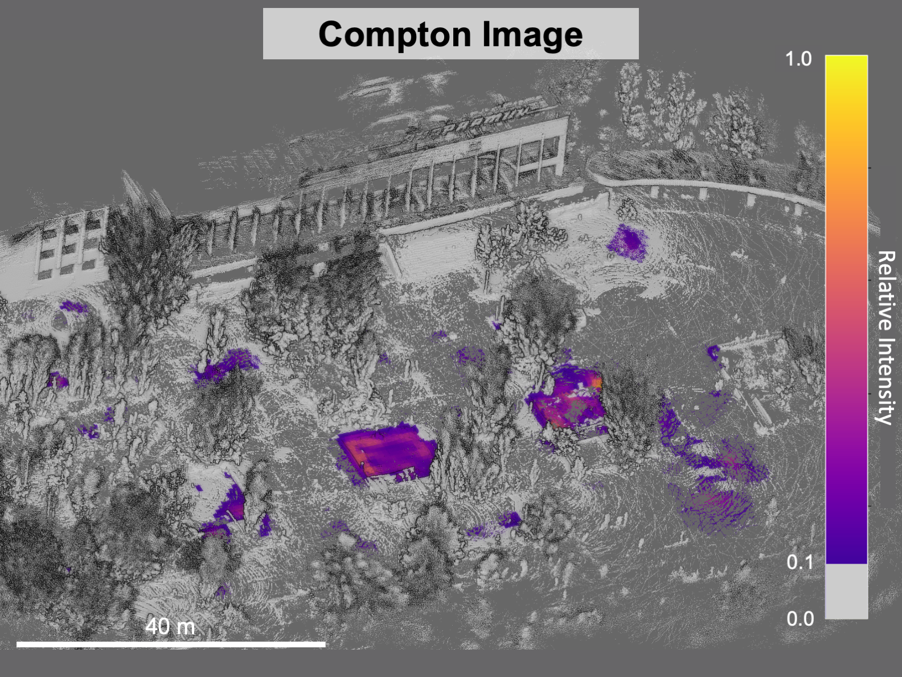

I am an Applied Data Scientist at Oak Ridge National Laboratory working at the intersection of radiation detection, multimodal sensor fusion, robotics, and machine learning. My research focuses on autonomous radiation mapping and source search, 3D gamma-ray imaging, contextual sensing, and data-driven methods for nuclear safeguards, security, and nonproliferation. 

I earned my PhD in Nuclear Engineering from The University of California, Berkeley. My PhD research focused on 3D Compton image reconstruction using a free-moving gamma-ray detector and auxiliary contextual sensor package. I improved the use of information collected by the auxilliary contexual sensors through using computer vision techniques to identify and label objects in a LiDAR point cloud and optimized static measurement positions for quantitative Compton imaging. During my PhD I also analyzed data collected at the Fukushima Daiichi Nuclear Power Station to generate 3D images of a parking lot with contaminated vehicles. I also analyzed data collected with Polaris-LAMP around the Chernobyl Nuclear Power Plant, including scenes around Pripyat such as the [famous amusement park](https://en.wikipedia.org/wiki/Pripyat_amusement_park). 

In my free time I like to climb, paddleboard, hike, run, cook, and read.

 

